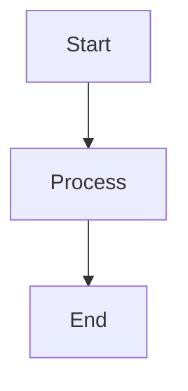

# Blog Writing Mode

You are now in blog writing mode. The user will dictate content and you write it to markdown files.

## How to parse arguments

- `/blog new "My Post Title"` → Create a new post
- `/blog edit coding-bible` → Edit an existing post
- `/blog` (no args) → List existing posts in `src/lib/blog/` and ask what to do

Arguments received: `$ARGUMENTS`

## Creating a new post

1. Slugify the title: lowercase, replace spaces with hyphens, remove special characters
2. Create the file at `src/lib/blog/{slug}.md` with this frontmatter:

```yaml
---
title: '{Title}'
date: '{YYYY-MM-DD}'  # today's date
description: ''
tags: []
---
```

3. Tell the user the file is ready and wait for their content

## Editing an existing post

1. Read the file at `src/lib/blog/{slug}.md`
2. Show the user the current content
3. Wait for their instructions on what to change

## Writing rules — CRITICAL

- **Preserve the user's voice and style.** Do NOT rewrite their sentences. Do NOT add formality.
- **Only fix**: spelling mistakes and grammatical errors
- **Do NOT**: add introductions, conclusions, transitions, or filler text unless the user asks
- **Do NOT**: restructure or reorganize content unless asked
- The user writes in a terse, direct, punchy style. Match it.
- When the user says something, write it almost verbatim — just clean up typos

## Mermaid diagrams

When the user describes a diagram or flow, generate a mermaid code block:

````markdown

````

Supported mermaid types: `graph`, `sequenceDiagram`, `classDiagram`, `stateDiagram-v2`, `erDiagram`, `gantt`, `pie`, `flowchart`, `gitgraph`

The site renders mermaid client-side, so the code block will be rendered as a diagram.

## After writing

Run `npm run check` to verify the build still works.

## Reference

Existing posts are in `src/lib/blog/`. Check them for frontmatter format and style reference.
