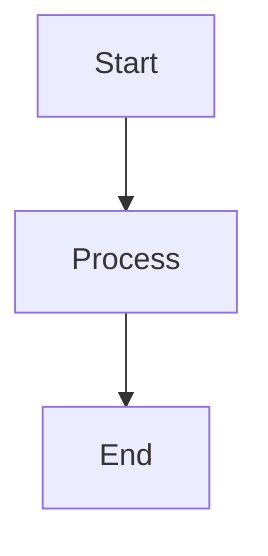

# Blog Writing

Use this skill for English blog posts in `src/lib/blog/*.md`. Arabic translations live in `src/lib/blog/ar/*.md` and are handled by the `arabify` skill.

## Request Parsing

Treat these as equivalent:

- `/blog new "My Post Title"`
- `$blog new "My Post Title"`
- `blog new "My Post Title"`

Create a new post for `new`. Edit an existing post for `edit`:

- `/blog edit coding-bible`
- `$blog edit coding-bible`
- `blog edit coding-bible`

If the user invokes the skill with no title, slug, or clear task, list existing posts from `src/lib/blog/` and ask what they want to do.

## Creating Posts

1. Slugify the title: lowercase, replace spaces with hyphens, remove special characters, collapse repeated hyphens, and trim leading or trailing hyphens.
2. Create `src/lib/blog/{slug}.md`.
3. If the file already exists, read it and ask before overwriting.
4. Use this frontmatter:

```yaml
---
title: 'Title'
date: 'YYYY-MM-DD'
description: ''
tags: []
---
```

Use the current date from the environment for `YYYY-MM-DD`. If the user already supplied post content, write it after the frontmatter. Otherwise, create only the frontmatter and tell the user the file is ready for their content.

## Editing Posts

1. Read `src/lib/blog/{slug}.md`.
2. If the user only asked to edit a slug without giving changes, show the current content or a concise summary and ask what to change.
3. If the user gave concrete changes, patch the file directly.
4. Preserve existing frontmatter keys unless the user asks to change metadata. Existing posts may use either `description` or `excerpt`; the app supports both.

## Writing Rules

- Preserve the user's voice and style.
- Only fix spelling mistakes and grammatical errors unless asked for a rewrite.
- Do not add introductions, conclusions, transitions, or filler text unless asked.
- Do not restructure or reorganize content unless asked.
- The user's style is terse, direct, and punchy. Match it.
- When the user dictates content, write it almost verbatim and only clean up typos.

## Mermaid Diagrams

When the user describes a flow or diagram, generate a Mermaid code block:

````markdown

````

Supported Mermaid types include `graph`, `flowchart`, `sequenceDiagram`, `classDiagram`, `stateDiagram-v2`, `erDiagram`, `gantt`, `pie`, and `gitgraph`.

## Verification

After creating or editing a post, run `npm run check` unless the user explicitly asks not to. Do not start the dev server unless the user asks.
